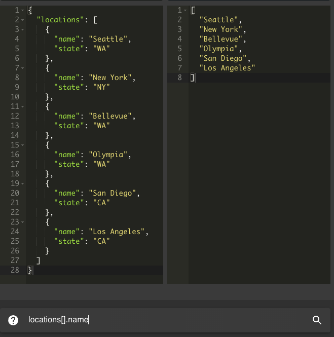

tl;dr - I made [https://www.jsonmate.pro](https://github.com/neojin/jsonmate.pro)

At the company I currently work at, we have a lot of APIs that receive and respond with JSON. I made jsonmate.pro because often I would watch my non-engineer peers on a screenshare trying to make sense of some JSON response, or convert it to a different structure. I know plenty of these apps already exist, but I was also in the middle of learning typescript, and if you're like me, it's easier to learn something by actively practicing it.

While brainstorming possible features to build for this, I came across [https://jmespath.org](https://jmespath.org), which is an excellent library for querying, transforming, and sorting your JSON. Here is a simple example of what you can do with it (notice how the JMES query `locations[].name` converts the input from left to right):

JMESPath is quite powerful, their tutorial page has plenty of examples - you can conditionally select, re-shape, and even sort your results: [https://jmespath.org/tutorial.html](https://jmespath.org/tutorial.html)

The code is open source and available here: [https://github.com/neojin/jsonmate.pro](https://github.com/neojin/jsonmate.pro).

For those curious, it was built with:

- React
- Typescript
- Vite
- Redux Toolkit
- Material UI
- ACE Editor

It runs on Netlify. Hope you find it useful!
